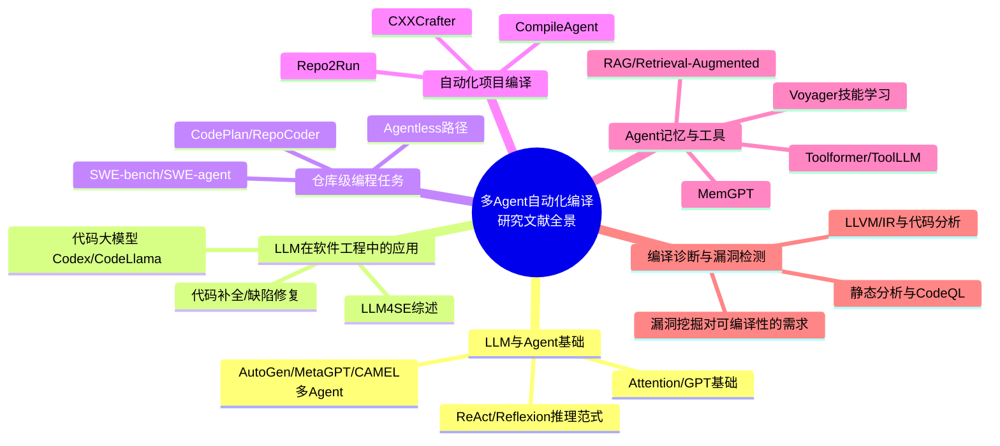
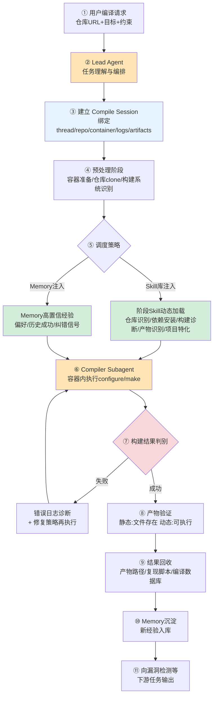
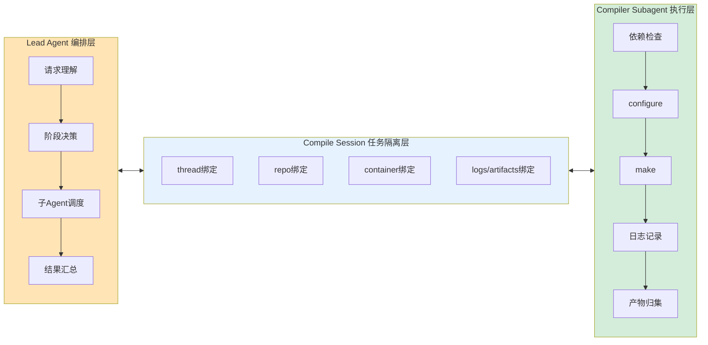
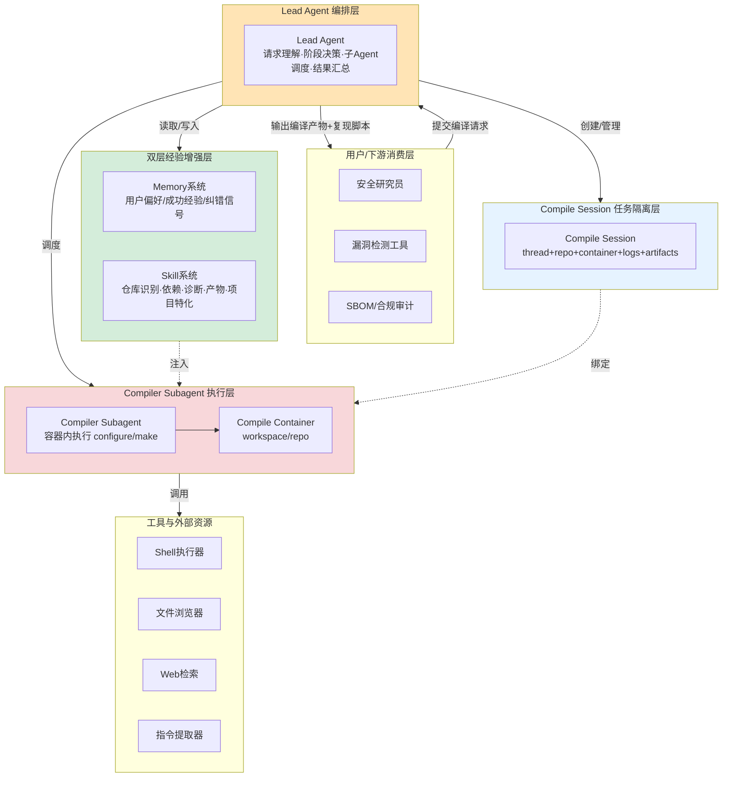
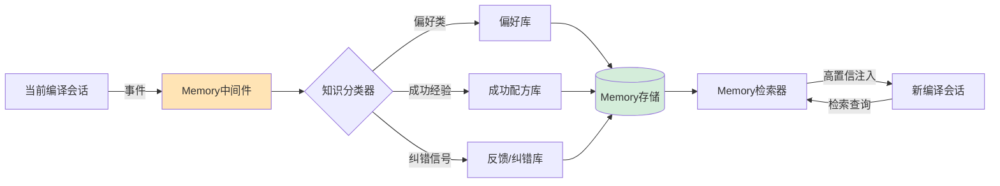
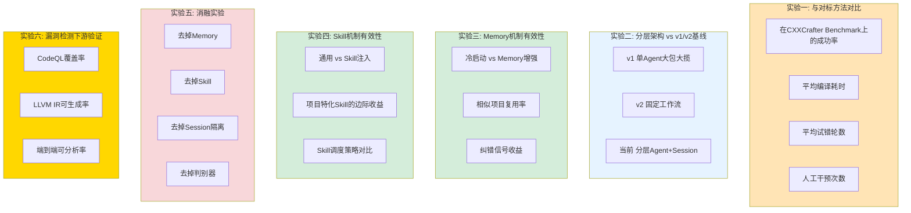

# 武汉理工大学硕士研究生选题报告书

---

**题　目**：面向漏洞检测需求的多 Agent 项目自动化编译方法研究

| 项目 | 内容 |
| --- | --- |
| 姓　　名 | 【姓名占位符】 |
| 学　　号 | 【学号占位符】 |
| 学生类别 | 全日制专业学位硕士 |
| 学科专业/类别/领域 | 软件工程 |
| 研究方向 | 软件工程与智能 Agent |
| 选题来源 | 自选项目 |
| 校内导师 | 【校内导师占位符】 |
| 校外导师 | 【校外导师占位符 / 或填"无"】 |
| 培养单位 | 计算机与人工智能学院 |
| 入学日期 | 【入学日期占位符】 |
| 开题日期 | 【开题日期占位符】 |

武汉理工大学研究生院制

---

## 填写说明

1. 填表前，请仔细阅读学校《武汉理工大学全日制研究生中期考核及开题实施办法》，在导师的指导下认真填写封面及导师意见以前的全部内容。
2. 硕士研究生学生类别分为：全日制学术型硕士、全日制专业学位硕士、非全日制学术型硕士、非全日制专业学位硕士四类。请按招生录取时的类别准确填写。
3. 选题来源请按照所列类别对应勾选，表内所列栏目均可另加附页。
4. 校内导师栏请将主导师填在第一，其他副导师填在其后；无校外导师的填写"无"。
5. 选题报告所列各栏内容要详细填写，要求语句通顺，表达明确、严谨，重点突出。
6. 本表一式一份，采取双面打印，纸张限用 A4（页边距为上、下：2.5cm，左为 2.6cm，右为 2.1cm；字体为宋体小四，行间距为 18 磅），所列栏目需保持原格式不变，装订整齐。
7. 考评结束，由答辩秘书汇总、登记选题报告成绩，经评委审核签字后，将本表集中移交学院研工办归档。

---

## 硕士研究生选题报告书

| 项目 | 内容 |
| --- | --- |
| **选题题目** | 面向漏洞检测需求的多 Agent 项目自动化编译方法研究 |
| **校内导师（组）** | 【校内导师占位符】 |
| **校外导师** | 【校外导师占位符】 |
| **职称** | 【职称占位符】 |
| **工作单位** | 【工作单位占位符】 |
| **选题分类** | □ 基础研究　☑ 应用研究　□ 综合研究　□ 其他 |
| **选题来源** | ☑ 自选项目（其余项目类别均未勾选） |
| **选题依托科研项目名称** | 无 |

---

## 一、文献综述

### 参考文献

[1] 国务院.《"十四五"国家信息化规划》[R]. 北京: 中央网络安全和信息化委员会, 2021.

[2] Vaswani A, Shazeer N, Parmar N, et al. Attention is all you need[C]//Advances in Neural Information Processing Systems. 2017: 5998-6008.

[3] Brown T B, Mann B, Ryder N, et al. Language models are few-shot learners[C]//Advances in Neural Information Processing Systems. 2020: 1877-1901.

[4] Yao S, Zhao J, Yu D, et al. ReAct: Synergizing reasoning and acting in language models[C]//International Conference on Learning Representations. 2023.

[5] Shinn N, Cassano F, Berman E, et al. Reflexion: Language agents with verbal reinforcement learning[C]//Advances in Neural Information Processing Systems. 2023.

[6] Wu Q, Bansal G, Zhang J, et al. AutoGen: Enabling next-gen LLM applications via multi-agent conversation[C]//International Conference on Learning Representations Workshop. 2024.

[7] Hong S, Zheng X, Chen J, et al. MetaGPT: Meta programming for a multi-agent collaborative framework[C]//International Conference on Learning Representations. 2024.

[8] Li G, Hammoud H, Itani H, et al. CAMEL: Communicative agents for "mind" exploration of large language model society[C]//Advances in Neural Information Processing Systems. 2023.

[9] Park J S, O'Brien J C, Cai C J, et al. Generative agents: Interactive simulacra of human behavior[C]//Proceedings of the ACM Symposium on User Interface Software and Technology. 2023.

[10] Packer C, Wooders S, Lin K, et al. MemGPT: Towards LLMs as operating systems[J]. arXiv preprint arXiv:2310.08560, 2023.

[11] Wang G, Xie Y, Jiang Y, et al. Voyager: An open-ended embodied agent with large language models[J]. Transactions on Machine Learning Research, 2024.

[12] Schick T, Dwivedi-Yu J, Dessì R, et al. Toolformer: Language models can teach themselves to use tools[C]//Advances in Neural Information Processing Systems. 2023.

[13] Qin Y, Liang S, Ye Y, et al. ToolLLM: Facilitating large language models to master 16000+ real-world APIs[C]//International Conference on Learning Representations. 2024.

[14] Jimenez C E, Yang J, Wettig A, et al. SWE-bench: Can language models resolve real-world GitHub issues?[C]//International Conference on Learning Representations. 2024.

[15] Yang J, Jimenez C E, Wettig A, et al. SWE-agent: Agent-computer interfaces enable automated software engineering[C]//Advances in Neural Information Processing Systems. 2024.

[16] Zhang K, Li Z, Li J, et al. CodeAgent: Enhancing code generation with tool-integrated agent systems for real-world repo-level coding challenges[C]//Annual Meeting of the Association for Computational Linguistics. 2024.

[17] Hou X, Zhao Y, Liu Y, et al. Large language models for software engineering: A systematic literature review[J]. ACM Transactions on Software Engineering and Methodology, 2024, 33(8): 1-79.

[18] Fan A, Gokkaya B, Harman M, et al. Large language models for software engineering: Survey and open problems[C]//IEEE/ACM International Conference on Software Engineering: Future of Software Engineering. 2023: 31-53.

[19] Chen M, Tworek J, Jun H, et al. Evaluating large language models trained on code[J]. arXiv preprint arXiv:2107.03374, 2021.

[20] Roziere B, Gehring J, Gloeckle F, et al. Code Llama: Open foundation models for code[J]. arXiv preprint arXiv:2308.12950, 2023.

[21] Lewis P, Perez E, Piktus A, et al. Retrieval-augmented generation for knowledge-intensive NLP tasks[C]//Advances in Neural Information Processing Systems. 2020: 9459-9474.

[22] Gao Y, Xiong Y, Gao X, et al. Retrieval-augmented generation for large language models: A survey[J]. arXiv preprint arXiv:2312.10997, 2023.

[23] Wang L, Lyu C, Ji T, et al. CXXCrafter: An LLM-based agent for automated C/C++ open source software building[C]//Proceedings of the ACM International Conference on the Foundations of Software Engineering. 2025.

[24] Hu Z, Zhu J, Wu J, et al. LLM-based agents for automating the enhancement of user story quality[C]//International Conference on Agile Software Development. 2024: 117-126.

[25] Bairi R, Sonwane A, Kanade A, et al. CodePlan: Repository-level coding using LLMs and planning[C]//ACM International Conference on Foundations of Software Engineering. 2024.

[26] Zhang F, Chen B, Zhang Y, et al. RepoCoder: Repository-level code completion through iterative retrieval and generation[C]//Conference on Empirical Methods in Natural Language Processing. 2023: 2471-2484.

[27] Chen W, Su Y, Zuo J, et al. AgentVerse: Facilitating multi-agent collaboration and exploring emergent behaviors[C]//International Conference on Learning Representations. 2024.

[28] 张少波, 李超, 王宇翔, 等. 大语言模型驱动的智能体研究综述[J]. 软件学报, 2025, 36(3): 1-32.

[29] 刘宇航, 黄叶根, 周明辉. 软件工程领域大语言模型的研究综述[J]. 软件学报, 2024, 35(6): 2842-2873.

[30] 罗永斌, 邹艳珍, 谢冰. 基于大语言模型的智能体软件工程研究综述[J]. 计算机研究与发展, 2025, 62(1): 1-25.

[31] 王宇飞, 邹艳珍, 余跃, 等. 基于深度学习的代码补全方法研究综述[J]. 软件学报, 2023, 34(11): 5076-5102.

[32] Newman C D, Decker M J, Alsuhaibani R, et al. SrcML: An infrastructure for the exploration, analysis, and manipulation of source code[J]. Science of Computer Programming, 2020, 192: 102413.

[33] Avgustinov P, de Moor O, Jones M P, et al. QL: Object-oriented queries on relational data[C]//European Conference on Object-Oriented Programming. 2016: 2:1-2:25.

[34] Lattner C, Adve V. LLVM: A compilation framework for lifelong program analysis & transformation[C]//International Symposium on Code Generation and Optimization. 2004: 75-86.

[35] Kang H J, Aw K L, Lo D. Detecting false alarms from automatic static analysis tools: How far are we?[C]//IEEE/ACM International Conference on Software Engineering. 2022: 698-709.

[36] Merkel D. Docker: Lightweight Linux containers for consistent development and deployment[J]. Linux Journal, 2014, 2014(239): 2.

[37] Khan A A, Badshah S, Liang P, et al. Software architecture for LLM-based multi-agent systems: A systematic mapping study[J]. arXiv preprint arXiv:2407.13934, 2024.

[38] Liu J, Wang K, Chen Y, et al. Large language model-based agents for software engineering: A survey[J]. arXiv preprint arXiv:2409.02977, 2024.

[39] Wang X, Wei J, Schuurmans D, et al. Self-consistency improves chain of thought reasoning in language models[C]//International Conference on Learning Representations. 2023.

[40] Xia C S, Deng Y, Dunn S, et al. Agentless: Demystifying LLM-based software engineering agents[J]. arXiv preprint arXiv:2407.01489, 2024.

[41] Eliseeva D, Akimov S, Stepanyan A, et al. From commit message generation to history-aware commit message completion[C]//IEEE/ACM International Conference on Automated Software Engineering. 2023: 723-735.

[42] Tian R, Ye Y, Qin Y, et al. DebugBench: Evaluating debugging capability of large language models[C]//Annual Meeting of the Association for Computational Linguistics. 2024.

[43] Hou X, Liu Y, Xu C, et al. CompileAgent: Automated real-world repo-level compilation with tool-integrated LLM-based agent system[J]. arXiv preprint arXiv:2505.04254, 2025.

[44] Wang Z, Bai J, Lu H, et al. Repo2Run: Automated build agent for any Python repository[J]. arXiv preprint arXiv:2502.13681, 2025.

[45] 周志强, 张攀, 王道顺. 基于大模型的自动化漏洞挖掘技术研究综述[J]. 信息安全学报, 2024, 9(5): 1-22.

[46] 蒋烈辉, 何红旗, 蔡瑞杰, 等. 软件二进制漏洞挖掘与利用研究综述[J]. 软件学报, 2023, 34(12): 5523-5560.

### 1. 主要文献资料查阅情况

围绕"面向漏洞检测需求的多 Agent 项目自动化编译方法研究"，本文重点查阅了**大语言模型与 Agent 系统**、**LLM 在软件工程中的应用**、**仓库级代码任务**、**自动化项目构建**、**Agent 记忆与工具增强**、**容器化执行与编译诊断**、**软件漏洞检测对可编译性的依赖**等方向的正式文献，共计 46 篇，其中中文文献 6 篇，外文文献 40 篇。中文文献主要服务于国内大模型 Agent 综述、软件工程 LLM 应用综述、代码补全研究综述和漏洞挖掘综述论证；外文文献主要服务于 LLM Agent 架构、仓库级编程任务、自动化编译方法、Agent 记忆/技能机制以及评测基准方法基础。

从文献结构看，可分为六类：

- **第一类**：LLM 基础与 Agent 架构研究 [2-13, 27, 39]，用于说明大语言模型推理、工具调用、自我反思与多 Agent 协作的方法基础；
- **第二类**：LLM Agent 在软件工程中的综述与应用 [17-18, 28-30, 37-38]，用于说明 LLM 驱动的软件工程任务已经从代码补全扩展到仓库级任务并形成系统性研究脉络；
- **第三类**：仓库级编程任务与代码 Agent [14-16, 25-26, 40]，用于支撑本文将"项目编译"作为一种仓库级 Agent 任务进行建模的合理性；
- **第四类**：自动化项目编译与构建 Agent 研究 [23, 43-44]，作为本文最直接的对标工作，提供方法对照、Benchmark 来源和差异化定位依据；
- **第五类**：Agent 记忆机制、工具增强与 RAG [10-13, 21-22]，用于说明 Memory 沉淀与外部知识检索是提升 Agent 长程任务效果的关键支撑；
- **第六类**：编译诊断、容器化执行与漏洞检测前置需求 [32-36, 45-46]，用于论证编译产物（IR / 二进制 / 编译数据库）对静态/动态漏洞检测的前置作用，以及容器化执行是保证可复现性的工程基础。

### 2. 对所阅读文献资料的综述

围绕"多 Agent 项目自动化编译"这一目标，现有文献可归纳为六大主题：

> **图 1 - 自动化编译 Agent 研究相关文献分类综述图**（占位，可由上述 Mermaid 渲染为思维导图）

#### 2.1 大语言模型与 Agent 架构研究

大语言模型的出现，使得"以自然语言为接口的程序行为"成为可能。Vaswani 等提出的 Transformer 架构 [2] 与 Brown 等提出的 GPT-3 [3] 奠定了 LLM 在自然语言推理与代码生成上的基础。在 LLM 推理范式方面，Yao 等提出的 ReAct [4] 将"推理（Reasoning）"与"行动（Acting）"交织，通过观察 → 思考 → 行动循环驱动复杂任务；Shinn 等提出的 Reflexion [5] 在此基础上加入语言化反馈学习，使 Agent 能够从失败中提炼经验；Wang 等的 Self-consistency [39] 则通过多路径采样投票提升推理稳定性。

在多 Agent 协作方面，AutoGen [6]、MetaGPT [7]、CAMEL [8] 和 AgentVerse [27] 分别提出了对话式协作、角色 SOP 化、双角色互动和多智能体涌现行为等架构。Park 等的 Generative Agents [9] 则展示了 Agent 在长程模拟中的记忆与规划行为。这些研究表明，**单 Agent 难以胜任跨越多个能力域、多个执行阶段的真实工程任务**，分层、协作或工具增强是主流应对方式。

这类研究的优点是提供了 Agent 任务建模的方法学基础；不足是其评测大多在通用基准（如 GSM8K、HotpotQA、MMLU）或封闭虚拟环境上完成，对"必须依赖真实容器、真实文件系统、真实编译工具链"的工程化场景指导有限。对本文的启发是：**项目编译是典型的真实工具调用 + 长上下文 + 多轮反馈任务，必须将通用 Agent 范式落地到"容器执行 + 编译日志反馈 + 经验沉淀"这一具体闭环。**

#### 2.2 LLM 在软件工程中的应用

LLM4SE（LLM for Software Engineering）已经形成了系统性综述。Hou 等 [17] 和 Fan 等 [18] 分别从工业与学术视角综述了 LLM 在需求分析、代码生成、缺陷修复、测试生成、文档生成等任务中的应用；国内罗永斌等 [30]、刘宇航等 [29] 也分别从软件工程智能体与软件工程大模型角度梳理研究脉络。这些综述共同表明：LLM4SE 已从"片段级代码补全"过渡到"仓库级任务"，从"单步生成"过渡到"多步规划 + 工具调用"。

在代码模型基础方面，Codex [19]、CodeLlama [20] 等大模型为代码理解与生成提供了通用底座；王宇飞等 [31] 对深度学习驱动的代码补全方法进行了系统综述。

这类研究的优点在于明确了 LLM 在软件工程中的能力边界与典型任务谱系；不足在于多数任务侧重"代码生成 / 修复 / 补全"，**对"如何把一个真实仓库从源码状态推进到成功构建状态"这一前置工程任务关注不足**。对本文启发是：项目编译应当作为 LLM4SE 的独立子任务而非附属环节进行建模。

#### 2.3 仓库级编程任务与代码 Agent

仓库级 Agent 任务是当前 LLM4SE 的研究前沿。Jimenez 等提出的 SWE-bench [14] 构建了首个真实 GitHub Issue 修复评测基准；其后续工作 SWE-agent [15] 则提出 Agent-Computer Interface（ACI）将 Agent 与计算机环境对接。Zhang 等提出的 CodeAgent [16] 强调工具集成（如文档检索、代码解析、Web 搜索）对仓库级任务的关键作用；Bairi 等的 CodePlan [25] 则将仓库级代码修改建模为基于规划的多步操作；Zhang 等的 RepoCoder [26] 通过迭代检索与生成完成仓库级代码补全；Xia 等的 Agentless [40] 提出无需复杂 Agent 调度的简化路径，在 SWE-bench 上取得有竞争力的结果。

这类研究的优点在于：将"仓库"作为一个完整任务单元，强迫方法处理多文件依赖、跨函数语义和真实工具链；不足在于其评测目标主要是 **Issue 修复或代码补全**，而**"从源码到可执行产物"的编译过程被默认为已经成立的前置条件**，反而不被显式建模。这一空缺正是本文要填补的——**编译本身是一个独立、复杂、对漏洞检测等下游任务具有刚需的仓库级 Agent 任务**。

#### 2.4 自动化项目编译与构建 Agent 研究

自动化项目编译方向已经出现了若干代表性工作。Wang 等提出的 **CXXCrafter** [23] 是面向 C/C++ 开源软件自动化构建的 LLM Agent，采用**解析器（Parser）—生成器（Generator）—执行器（Executor）**三层模块化设计，能够从 README/INSTALL 等文档抽取构建命令、生成构建脚本、并通过执行—反馈—修复闭环完成自动化构建。Hou 等提出的 **CompileAgent** [43] 进一步将工具集成的 LLM Agent 应用到真实仓库级编译，强调工具间的协作与异常恢复。Wang 等提出的 **Repo2Run** [44] 则面向 Python 仓库自动构建可运行环境，验证了 Agent 在依赖解析与环境搭建上的能力。

这类研究的优点在于：明确将编译任务作为 LLM Agent 的研究对象，并提供了三层模块化或工具集成的可行架构，CXXCrafter 还公开了 C/C++ 项目 Benchmark 与对比指标。**不足主要有三点**：
1. **缺乏对"任务隔离与可复现性"的系统设计**——多任务并行时容器、日志、产物如何隔离，缺乏统一抽象，导致工程化部署困难；
2. **缺乏对"跨任务经验沉淀"的建模**——同类项目的成功配方、用户偏好与纠错信号无法在多次会话间积累，每次构建都是冷启动；
3. **缺乏对"领域知识动态注入"的机制**——面对 ffmpeg、Linux 内核、LLVM 等具有强领域知识的项目，通用 Agent 容易盲目试错。

CXXCrafter 的三层架构本质上仍是**面向单次任务的工具链流水线**，与现代 Agent 框架（如 deerflow 系列）所强调的**Lead-Subagent 编排 + 长期 Memory + 可插拔 Skill**的范式相比，仍有显著差距。本文以 CXXCrafter 作为方法对标和 Benchmark 来源，提出**分层 Agent 编排 + 双层经验增强**机制，是对该方向的系统性补充。

#### 2.5 Agent 的记忆机制、工具增强与 RAG

Agent 的长程任务能力高度依赖记忆与工具。Packer 等提出的 **MemGPT** [10] 借鉴操作系统分层存储，将上下文之外的内容卸载到外部存储并按需调入，实现了"虚拟无限上下文"。Wang 等的 **Voyager** [11] 在 Minecraft 中验证了 Agent 通过自动技能生成与积累，实现开放式任务自主学习——**技能（Skill）作为可复用代码单元被持续添加到 Skill 库**，这正是本文 Skill 动态加载机制的灵感来源。

工具增强方面，Toolformer [12] 让模型自监督学习工具调用接口，ToolLLM [13] 则进一步把工具调用扩展到 16000+ 真实 API。RAG（Retrieval-Augmented Generation）[21-22] 通过外部检索向生成提供事实依据，是处理"项目特定文档/历史日志"的标准方法。

这类研究的优点在于：明确指出"长期记忆 + 外部工具 + 检索增强"是突破 LLM 上下文/知识限制的关键路径；不足在于其多数应用场景是开放问答、游戏环境或通用问答，**鲜有将这一机制系统性应用到项目编译这一具体工程任务上**。对本文的启发是：**记忆系统应当沉淀"用户偏好—成功配方—失败教训"三类编译相关知识；技能系统应当将"仓库识别—依赖安装—构建诊断—产物识别—项目特化"五类阶段性知识可插拔地注入到 Agent 的执行过程中**。

#### 2.6 漏洞检测对可编译性的需求与本文应用主线

软件漏洞检测是本课题的核心应用驱动力。LLVM/Clang [34] 等工具链产生的 IR 与编译数据库（compile_commands.json）是众多静态分析工具（如 CodeQL [33]、Coverity 等）和动态分析工具（如 KLEE、AFL 等）的输入前提；Kang 等 [35] 也指出，静态分析工具的可用性在很大程度上取决于"分析输入是否完整可得"。蒋烈辉等 [46] 与周志强等 [45] 在漏洞挖掘综述中明确指出：**对开源项目进行规模化漏洞检测的最大瓶颈之一是"目标项目无法被稳定编译"**，这导致大量项目的 IR、二进制、调试符号无法生成，分析工具被迫退化或失效。SrcML [32]、Docker [36] 等基础工具虽提供了源码解析与环境隔离手段，但仍需上层 Agent 来组合调用。

这一类研究的优点是明确了**编译产物在漏洞检测中的不可替代地位**；不足在于现有工作多聚焦"检测算法本身"，对"如何把一个 GitHub 项目稳定推进到可分析状态"这一前置工程问题鲜有专门研究。对本文的启发是：**本文不直接研究漏洞检测算法，而是研究漏洞检测前置环节的关键瓶颈——自动化编译——为下游静态/动态分析提供高覆盖、可复现、可追溯的编译产物**。

#### 2.7 文献评述、研究启迪及本文定位

从总体思路看，相关研究经历了从**单步代码生成**到**多步推理 + 工具调用**、从**通用问答 Agent**到**软件工程仓库级 Agent**、从**一次性构建脚本**到**Agent 驱动的自动化编译**的发展过程。然而，针对"**面向漏洞检测需求的项目自动化编译**"这一交叉场景，仍存在四个尚未被系统性回答的问题：

1. **任务隔离与可复现性问题**：现有自动化编译 Agent（如 CXXCrafter、Repo2Run）尚未给出"会话—容器—日志—产物"一体化的隔离抽象，并行任务与历史回溯成本高；
2. **经验沉淀问题**：每一次编译都是冷启动，相同/相似项目的成功配方、用户纠错与失败教训无法跨会话累积；
3. **领域知识注入问题**：面对 ffmpeg、Linux 内核、LLVM 等强领域知识项目，通用 Agent 容易陷入盲目试错；
4. **架构灵活性与可控性的平衡问题**：单 Agent 大包大揽（v1 路线）灵活但失控；固定工作流（v2 路线）可控但僵化。需要在"灵活性"与"确定性"之间寻找平衡。

因此，本文受到的启发是：应避免把研究退化为"再做一个 LLM 编译工具"或"再调一遍 ReAct 编译流水线"，而应**将研究边界收敛为"分层 Agent 编排 + 双层经验增强（Memory + Skill）"的自动化编译方法**。具体而言：以 Lead Agent 负责任务理解与编排、以 Compiler Subagent 负责容器内执行、以 Compile Session 作为任务隔离与可复现的载体；以 Memory 沉淀跨会话经验、以 Skill 动态注入阶段性领域知识；最终为漏洞检测等下游任务提供稳定、可复现、可追溯的编译产物。

（本表可附页）

---

## 二、和选题相关的调研报告

### 1、调研时间

【调研起始日期占位符】至【调研截止日期占位符】。

### 2、调研地点

【调研地点占位符——例如：武汉理工大学计算机与人工智能学院实验室、合作单位现场、远程线上调研】。

### 3、调研单位

【调研单位占位符——例如：武汉理工大学相关研究团队、合作企业安全实验室、开源社区维护组等】。

### 4、调研方式

本课题前期采用**真实仓库走查、对标论文复现、原型系统迭代、漏洞检测工具链评估、开源社区文献检索**相结合的方式开展调研。

- **真实仓库走查**：从 GitHub 抽取多语言、多构建系统（CMake / Make / Autotools / Meson）的开源项目，由人工尝试编译，记录环境识别失败、依赖缺失、configure 报错、产物验证不充分等真实痛点；
- **对标论文复现**：以 CXXCrafter [23]、CompileAgent [43]、Repo2Run [44] 为对标，复现其编译流水线，量化其在不同语言、不同复杂度项目上的成功率与失败模式；
- **原型系统迭代**：基于 deerflow 系列多 Agent 框架进行二次开发，先后形成 v1（单 Agent 大包大揽）、v2（固定工作流 + 编译子 Agent）和当前版本（Lead Agent + Compiler Subagent + Compile Session）三个原型，逐步暴露并解决任务隔离、灵活性—确定性平衡、经验沉淀等问题；
- **漏洞检测工具链评估**：对 LLVM/Clang、CodeQL、AFL 等代表性工具的输入要求进行分析，确认编译产物（IR / 二进制 / 编译数据库 / 调试符号）对下游漏洞检测的不可替代性；
- **文献检索**：围绕 LLM Agent、仓库级任务、自动化编译、记忆机制、Skill 学习与漏洞检测前置等方向开展系统检索。

### 5、主要收获

调研表明，**自动化编译并非简单的"调用一次 shell"**，而是涉及**任务理解 → 环境识别 → 依赖安装 → 构建 → 诊断 → 产物验证 → 经验沉淀**七个阶段的完整链条。漏洞检测、SBOM 生成、合规审计、CI/CD 流水线均高度依赖"项目能否被稳定编译"这一前提，而当前自动化编译方案多停留在**单 Agent 一次性流水线**层面，缺乏：

- **任务隔离层**：多个仓库并行编译时，容器、日志、产物相互污染，难以独立回溯；
- **经验沉淀层**：每次构建都是冷启动，相似项目的成功经验不能沉淀复用；
- **领域知识层**：面对 ffmpeg、Linux 内核等强领域知识项目，Agent 缺乏针对性指导；
- **架构灵活性—确定性平衡**：v1 单 Agent 大包大揽过于灵活、易失控；v2 固定工作流过于僵化、不能应对真实异常。

经过 v1 → v2 → 当前版本的迭代验证，最终形成"**Lead Agent 编排 + Compiler Subagent 执行 + Compile Session 隔离 + Memory 沉淀 + Skill 动态注入**"的整体架构。该架构既保留了 ReAct 范式的灵活性，又通过会话隔离和阶段技能保证了可控性，是后续研究的工程基础。同时，本文将研究目标明确收敛为"**面向漏洞检测需求的自动化编译方法**"，以避免课题被泛化为"通用 LLM 编程 Agent"——这与评审中对"研究边界清晰"的要求是一致的。

---

## 三、选题报告

### 1. 所选课题的题目及课题来源

本课题题目为"**面向漏洞检测需求的多 Agent 项目自动化编译方法研究**"。课题来源为**自选项目**应用研究，面向规模化软件漏洞检测、SBOM 生成、CI/CD 流水线等场景对"项目可稳定编译"的真实需求展开。课题依托前期对 CXXCrafter [23]、CompileAgent [43]、Repo2Run [44] 等对标论文的调研，以及在 deerflow 系列多 Agent 框架上的 v1/v2/当前版本三轮原型迭代，研究 Lead Agent 编排、Compiler Subagent 执行、Compile Session 任务隔离、Memory 经验沉淀和 Skill 动态加载等关键机制。

### 2. 课题研究的目的、意义

#### 2.1 研究目的

软件漏洞检测、SBOM 报告生成、CI/CD 流水线和供应链安全审计等下游任务都依赖一个隐含前提：**目标项目能够被稳定编译，并产生可分析的中间产物**（IR、二进制、调试符号、编译数据库）。然而，当前开源生态呈现**多语言混合、多构建系统并存、依赖关系复杂、跨平台差异显著**等特征，导致大量项目无法被自动化、规模化地编译——人工配置成本极高，是漏洞检测和合规审计规模化推广的核心瓶颈之一。

从技术条件看，**单 Agent 一次性流水线**难以应对真实仓库的复杂度：v1 路线由单 Agent 大包大揽，灵活但易失控；v2 路线采用固定工作流，确定但难以应对未知异常；现有对标工作（CXXCrafter、CompileAgent、Repo2Run）虽实现了基础自动化，但缺少**任务隔离层、经验沉淀层和领域知识注入层**。因此，本课题拟构建一套**分层 Agent 编排 + 双层经验增强**的自动化编译方法框架，向漏洞检测等下游任务提供"高覆盖、可复现、可追溯"的编译产物，辅助安全分析人员把工作焦点从"先把项目编出来"前移到"分析漏洞本身"。

#### 2.2 研究意义

在**理论研究**上，本课题将"项目编译"建模为一个独立的仓库级 Agent 任务，探索分层 Agent 编排在长程工程任务中的可行边界；研究 Memory 跨会话经验沉淀对 LLM Agent 长期能力增长的支撑机制；研究 Skill 动态加载在领域知识强相关任务上的注入效果——这三方面共同构成对当前 LLM4SE 研究的有益补充。

在**实际应用意义**上，本课题面向漏洞检测前置编译需求，**显著降低规模化分析的人工配置成本**，使安全研究人员能够把更多时间放在漏洞本身的研判与修复上；同时，本课题的 Memory + Skill 机制为后续企业级部署提供了可演进的能力增量路径，能够随着使用过程持续积累经验、扩展能力。

### 3. 国内外研究现状分析

国内外在 LLM Agent、软件工程 LLM 应用、仓库级编程任务、自动化项目构建、Agent 记忆与工具增强等方向已形成较好的研究基础，但**面向漏洞检测前置编译需求的、具备 Memory + Skill 双层能力增强的多 Agent 编译方法**仍是空白。

在 **LLM Agent 与多 Agent 协作**方面，ReAct [4]、Reflexion [5]、AutoGen [6]、MetaGPT [7]、CAMEL [8] 等代表性工作建立了从"单步推理"到"多 Agent 协作 SOP"的方法谱系；MemGPT [10]、Voyager [11] 验证了长期记忆与技能积累对 Agent 长程任务能力的关键支撑作用；Toolformer [12]、ToolLLM [13] 则提供了大规模工具调用基础。

在 **LLM4SE 与仓库级任务**方面，SWE-bench [14]、SWE-agent [15] 建立了真实 GitHub 任务评测范式；CodeAgent [16]、CodePlan [25]、RepoCoder [26]、Agentless [40] 则在仓库级代码理解、补全与修复任务上展示了 Agent 工具集成、规划与简化路径的多元探索。但**这些工作普遍把"项目可编译"作为默认前提，反而不显式建模编译过程本身**。

在**自动化项目编译**方向，**CXXCrafter [23]** 是与本文最直接的对标工作。其提出 Parser-Generator-Executor 三层模块化设计，公开了面向 C/C++ 开源软件的自动化构建 Benchmark；**CompileAgent [43]** 进一步强调工具集成与异常恢复；**Repo2Run [44]** 则面向 Python 仓库自动搭建可运行环境。三者证明了 LLM Agent 在自动化编译方向的可行性，但**共同存在三大不足**：

1. **缺乏会话级任务隔离抽象**——多任务并行时，容器、日志、产物相互污染，可复现性差；
2. **缺乏跨会话经验沉淀机制**——每次构建都是冷启动，用户偏好、相似项目成功配方、纠错信号都无法累积；
3. **缺乏领域知识动态注入机制**——面对 ffmpeg、Linux 内核、编译器自身等强领域知识项目，通用 Agent 容易盲目试错。

在**漏洞检测对可编译性的依赖**方面，蒋烈辉等 [46] 和周志强等 [45] 的综述均明确指出："**可分析输入的获取**"是大规模软件漏洞挖掘的核心瓶颈之一；LLVM/Clang [34]、CodeQL [33] 等主流工具的输入要求进一步强化了这一观点。然而，已有研究多关注漏洞检测算法本身，鲜有专门研究"如何把任意 GitHub 项目稳定推进到可分析状态"这一前置工程问题。

基于上述现状，本文将研究边界明确收敛到：**以漏洞检测前置编译为应用主线，以分层 Agent 编排为系统骨架，以 Compile Session 为任务隔离载体，以 Memory + Skill 为能力增强双层**，输出可被静态/动态漏洞检测工具直接消费的编译产物与可追溯的复现脚本。本文**不研究漏洞检测算法本身**，也**不追求覆盖所有编程语言**——以 C/C++ 项目为首要目标（与 CXXCrafter Benchmark 对齐），并对 Java/Python 等做扩展验证；以分层 Agent + Memory + Skill 的方法贡献为论文核心。

### 4. 研究目标、研究内容和拟解决的关键问题

#### 4.1 研究目标

本文面向漏洞检测、SBOM 生成等下游任务对"项目可稳定编译"的真实需求，针对现有自动化编译 Agent**缺乏任务隔离、缺乏经验沉淀、缺乏领域知识注入、缺乏架构灵活性与可控性平衡**等问题，研究**多 Agent 项目自动化编译方法**，构建以 Lead Agent 编排、Compiler Subagent 执行、Compile Session 任务隔离、Memory 经验沉淀和 Skill 动态加载为核心机制的完整方法框架，**实现高覆盖、可复现、可追溯的项目自动化编译**，向漏洞检测等下游任务输出稳定可分析的编译产物。

#### 4.2 研究内容

本文研究内容并非单一的 LLM 工具调用流程，而是**从任务理解、Agent 编排、容器执行、经验沉淀到知识注入的完整方法体系**。本课题总体研究流程如图 2 所示。

> **图 2 - 多 Agent 项目自动化编译总体研究流程**

图 2 展示了本课题从用户编译请求接入开始，经由 Lead Agent 任务理解与编排、Compile Session 任务隔离、Skill 动态加载与 Memory 经验注入、Compiler Subagent 容器内执行、构建结果判别与产物验证，最终向漏洞检测等下游任务输出可分析编译产物的完整流程。

研究内容具体包括三大主题：

##### 内容一：分层 Agent 编排架构与 Compile Session 任务隔离机制

围绕"灵活性—确定性—可复现性"三者的平衡，研究**Lead Agent 编排 + Compiler Subagent 执行 + Compile Session 任务隔离**的分层架构。**Lead Agent** 负责接收用户编译请求、识别仓库/分支/构建目标/产物要求、决定当前阶段需要的能力、调度子 Agent 并汇总结果；**Compiler Subagent** 在 Lead Agent 调度下专注于容器内编译命令执行，只操作 `/workspace/repo`，避免对宿主或其他会话产生副作用；**Compile Session** 作为任务隔离与可复现载体，绑定 thread、repo、container、logs、artifacts，为多任务并行、历史回溯、复现复盘提供统一抽象。

视频侧具体处理流程如图 3 所示。

> **图 3 - 分层 Agent 编排与 Compile Session 任务隔离架构**

##### 内容二：跨会话 Memory 经验沉淀机制

围绕"冷启动 → 持续学习"目标，研究**通过 MemoryMiddleware 挂载到 Lead Agent 执行链的跨会话经验沉淀机制**。Memory 系统记录三类高价值知识：

- **用户偏好**：例如某用户长期偏好静态链接产物、偏好 release 编译选项；
- **历史成功经验**：某类项目（如 ffmpeg、openssl）的成功 configure 选项组合、依赖安装命令、补丁顺序；
- **纠错与反馈信号**：用户对历史结果的反馈（"你理解错了"、"重试"、"这样就对了"），用于校准 Agent 的判断置信度。

Memory 注入策略：**只注入高置信度 facts 到当前任务上下文，避免污染**；结合 RAG [21-22] 的检索方式，按"项目类型 / 构建系统 / 错误特征"键值检索；并与下文 Skill 系统形成互补——Skill 提供通用领域知识，Memory 提供个性化历史经验。

##### 内容三：阶段 Skill 动态加载知识增强机制

围绕"通用 Agent 容易在强领域知识项目上盲目试错"问题，研究**将编译流程拆解为可插拔 Skill 的动态注入机制**。当前规划五大类 Skill：

| Skill 类别 | 作用 |
| --- | --- |
| 仓库识别 Skill | 识别 CMake / Make / Autotools / Meson 等项目类型与版本要求 |
| 依赖安装 Skill | 根据项目特征动态补充系统依赖、工具链和库依赖说明 |
| 构建诊断 Skill | 在 configure 或 make 失败时，提供针对性的排障建议 |
| 产物识别 Skill | 自动判断可执行文件、库文件、安装目录和复现脚本 |
| 项目特化 Skill | 例如 ffmpeg、linux kernel、compiler、multimedia 等专项编译知识 |

Skill 调度策略：**Lead Agent 决定当前阶段需要什么能力 → 检索对应 Skill → 作为补充说明注入到 system prompt / 执行策略 / Compiler Subagent 上下文中**。Skill 与 Memory 的关键区别：**Skill 是相对静态的通用领域知识（开发者预先编写或半自动生成），Memory 是动态积累的个性化历史经验**——两者组合即可同时获得"通用领域厚度"和"个性化深度"。

#### 4.3 拟解决的关键问题

本课题的难点不在于"调用一次 LLM 生成 make 命令"，而在于**如何在真实仓库的多样性、构建系统的复杂性、错误模式的不可穷举性面前，让 Agent 系统具备可控、可复现、可演进的工程能力**。其核心问题是：在通用 LLM 不具备项目特化知识、单 Agent 难以兼顾灵活性与可控性、跨会话经验难以沉淀的条件下，如何通过**分层 Agent 编排 + 任务隔离 + 双层经验增强**机制，使自动化编译系统在真实仓库上获得显著高于现有方法的稳定性与成功率，并向漏洞检测等下游任务提供可直接消费的编译产物。

1. **架构灵活性与确定性平衡问题**：本课题需要解决的不是单一 prompt 工程问题，而是**在分层 Agent 架构下，Lead Agent 何时调度子 Agent、何时调用工具、何时回退到固定流水线**的策略问题。该问题本质是在 ReAct 等灵活范式与固定工作流之间寻找适合编译任务的折中点。
2. **任务隔离与可复现性问题**：真实部署中往往会有多个并行编译任务，且每个任务可能需要被回溯、复盘、复现。需要研究**Compile Session 作为统一抽象**，如何在容器、日志、产物、上下文等多个维度上实现一体化绑定和隔离。
3. **跨会话经验沉淀与注入问题**：Memory 系统需要解决"**哪些信息值得记、如何检索、何时注入、注入多少**"四个子问题，需要在记忆容量、检索精度、注入时机和上下文长度之间取得平衡，避免误导后续任务。
4. **领域 Skill 编写与调度问题**：Skill 的设计需要兼顾**通用性（覆盖多类项目）和特化性（深入强领域项目）**，并需要解决"Lead Agent 如何在合适阶段选择合适 Skill"的调度问题——这是一个介于固定规则与 LLM 决策之间的混合问题。

### 5. 拟采取的研究方法、技术路线

本文拟采取的研究方法与三项研究内容相对应，整体上按照"**分层 Agent 编排 → Compile Session 任务隔离 → Memory + Skill 双层经验增强**"的思路展开。技术路线分为**主线方法实现**与**对标实验验证**两部分。本课题总体技术架构如图 4 所示。

> **图 4 - 多 Agent 自动化编译系统总体技术架构**

#### 1. 分层 Agent 编排方法

借鉴 ReAct [4]、AutoGen [6] 等多 Agent 范式，结合编译任务"长程、强工具依赖、强反馈"特征，设计 **Lead Agent + Compiler Subagent** 两层编排：

- **Lead Agent**：基于大语言模型实现，输入用户请求，输出阶段决策与子 Agent 调度指令；
- **Compiler Subagent**：基于工具增强 LLM 实现，只在容器内执行编译相关命令，与 Lead Agent 通过 task 接口（`task(..., subagent_type="compiler")`）通信；
- **判别器机制**：借鉴 CXXCrafter [23] 的 Discriminator，在每次构建后结合静态（文件存在性）与动态（产物可执行性、关键日志）双重判别构建是否真实成功。

#### 2. Compile Session 任务隔离方法

将"thread + repo + container + logs + artifacts"绑定为统一的 Compile Session 抽象。任意时刻系统可有 N 个并行 Session，互不污染；任意历史 Session 可被加载，用于复盘、复现或继续执行。Session 持久化到数据库与对象存储，提供完整事件流追踪。

#### 3. 跨会话 Memory 经验沉淀方法

通过 **MemoryMiddleware** 挂载到 Lead Agent 执行链上，覆盖三类沉淀目标：

> **图 5 - Memory 经验沉淀与注入机制**

#### 4. 阶段 Skill 动态加载方法

Skill 以**结构化文档 + 执行规则**形式组织（参考 Voyager [11] 的 Skill Library 范式）。Lead Agent 在阶段决策时检索对应 Skill，将其内容注入到当前阶段的 system prompt 或 Compiler Subagent 的上下文中。Skill 与 Memory 协同：Skill 提供通用领域知识，Memory 提供个性化经验。

#### 5. 容器化执行环境与产物验证

借鉴 Docker [36] 容器化思路，每个 Compile Session 对应一个独立容器，容器内预置基础工具链（gcc/clang/python/java 等）与系统包；构建产物通过卷挂载到 Session 工件目录，便于下游漏洞检测工具直接消费。

### 6. 实验设计与评价指标

为了验证本文方法的有效性，实验设计分为**主实验**和**消融实验**两部分。

> **图 6 - 实验设计与评价指标体系**

#### 评价指标

- **任务级指标**：编译成功率（Success Rate）、平均编译耗时（Avg Time）、平均试错轮数（Avg Retries）、人工干预次数（Manual Intervention Count）；
- **架构级指标**：v1/v2/当前架构在相同 Benchmark 上的对比；
- **经验沉淀指标**：相似项目首次 vs 再次编译成功率/耗时差异、Memory 检索命中率、Memory 注入精度；
- **Skill 增强指标**：通用 Agent vs 注入对应 Skill 后的成功率差异、Skill 边际收益曲线；
- **下游可用性指标**：编译产物在 CodeQL [33]、LLVM IR [34] 等漏洞检测工具上的可分析率；
- **消融指标**：分别去掉 Memory / Skill / Session 隔离 / 判别器后整体性能下降幅度。

#### 数据集

**主实验**：以 CXXCrafter [23] 公开的 C/C++ 开源软件 Benchmark 作为核心评测集合，保证与已有论文方法的可比性；**扩展实验**：从 GitHub Trending 中抽取 Java / Python 各 30+ 项目作为方法泛化能力验证集合。

### 7. 预期研究成果和创新点

#### 7.1 预期研究成果

1. **理论成果**：形成面向漏洞检测前置编译需求的**分层 Agent 编排 + Compile Session 任务隔离**方法；形成**Memory 跨会话经验沉淀 + Skill 阶段知识动态注入**的双层经验增强机制；为 LLM4SE 中"项目编译"这一独立子任务建立可演进的方法学骨架。
2. **系统成果**：构建一套完整的多 Agent 项目自动化编译原型系统，覆盖 Lead Agent 编排、Compiler Subagent 执行、Compile Session 隔离、Memory 沉淀和 Skill 注入五大模块；提供面向 C/C++ 项目的成熟支持，并对 Java/Python 完成扩展验证。
3. **量化成果**：完成 CXXCrafter Benchmark 上的成功率、耗时、试错轮数等量化对比；完成 v1/v2/当前三个版本的演进路径对照实验；完成 Memory、Skill、Session、判别器四模块的消融实验；完成硕士论文撰写与相关论文/软著申报。

#### 7.2 创新点

**创新点一：面向自动化编译任务的分层 Agent 架构（Lead + Compiler + Session）**

针对现有自动化编译 Agent（CXXCrafter [23]、CompileAgent [43]、Repo2Run [44]）**缺乏会话级任务隔离抽象**、**单 Agent 一次性流水线难以兼顾灵活性与可控性**等问题，本文提出 **Lead Agent + Compiler Subagent + Compile Session** 三件套架构：Lead Agent 负责任务理解、阶段决策与结果汇总，Compiler Subagent 在容器内专注执行，Compile Session 把 thread/repo/container/logs/artifacts 绑定为一体化隔离单元。该架构使系统在保留 ReAct 灵活性的同时获得明确的执行边界与可追溯能力，并支持多任务并行、历史回溯与失败复盘，是对现有编译 Agent 工程化能力的实质性补强。

**创新点二：面向自动化编译任务的双层经验增强机制（Memory 沉淀 + Skill 动态加载）**

针对现有方法**每次编译都是冷启动、无法跨会话累积经验、面对强领域知识项目盲目试错**等问题，本文提出**Memory + Skill 双层经验增强机制**：Memory 跨会话沉淀用户偏好、历史成功配方和纠错信号，按"高置信度按需注入"策略避免上下文污染；Skill 将仓库识别、依赖安装、构建诊断、产物识别、项目特化五类领域知识封装为可插拔模块，由 Lead Agent 在阶段决策时动态加载到 Compiler Subagent 执行链中。Memory 提供**个性化深度**、Skill 提供**通用领域厚度**，两者协同显著提升自动化编译系统在重复任务、复杂项目和未知场景下的表现。

### 8. 研究进度安排及论文写作计划

| 时间区间 | 工作内容 |
| --- | --- |
| **【前期】至开题** | 完成 v1（单 Agent 大包大揽）、v2（固定工作流 + 编译子 Agent）原型，沉淀演进经验；完成 CXXCrafter、CompileAgent、Repo2Run 等对标论文的复现与差异化分析；完成文献综述与开题报告。 |
| **开题后 3 个月内** | 完善 Lead Agent + Compiler Subagent + Compile Session 三件套架构；完成容器化执行环境的工程化封装；在 CXXCrafter Benchmark 上跑通主实验基线。 |
| **开题后 4-6 个月** | 实现 Memory 中间件与持久化存储；设计 Memory 注入策略；完成 Memory 模块上线与初步实验。 |
| **开题后 7-9 个月** | 设计并实现五大类 Skill（仓库识别 / 依赖安装 / 构建诊断 / 产物识别 / 项目特化）；完成 Lead Agent 的 Skill 调度策略；完成 Skill 模块上线与初步实验。 |
| **开题后 10-12 个月** | 完成主实验（与对标对比）、架构演进对照实验、Memory 与 Skill 有效性实验、消融实验、下游漏洞检测可用性验证；完成扩展实验（Java/Python）。 |
| **开题后 13-14 个月** | 完成硕士论文撰写、修改、查重和送审材料准备；完成相关论文/软著申报。 |

研究生签名：　　　　　　　　　　　　　　【开题日期占位符】

（本表可附页）

---

## 四、指导教师（组）对选题报告的意见

【待导师填写】

☐ 同意进行开题答辩　　☐ 不同意进行开题答辩

指导教师签名：　　　　　　　　　　　　　　　　　　　20　　年　　月　　日

---

## 五、选题报告答辩情况

| 项 | 内容 |
| --- | --- |
| **答辩时间** | 【答辩时间占位符】 |
| **答辩地点** | 【答辩地点占位符】 |

### 1、评议小组对选题报告提出的主要问题及研究生回答情况

【待答辩后填写】

### 2、评议小组意见

1. 选题价值：☐ 有理论意义；☐ 有工程背景；☐ 有实用价值；☐ 意义不大；☐ 其他
2. 选题难度：☐ 偏高；☐ 适当；☐ 偏低
3. 工作量：☐ 偏大；☐ 适当；☐ 偏小
4. 研究方法、思路及实施方案的可行性：☐ 好；☐ 较好；☐ 一般；☐ 不可行
5. 选题报告中反映出的综合能力和文献积累：☐ 好；☐ 较好；☐ 一般；☐ 较差
6. 选题报告中反映出的创新能力：☐ 好；☐ 较好；☐ 一般；☐ 较差
7. 对论文选题报告的总体评价：☐ 好；☐ 较好；☐ 一般；☐ 较差

**存在的问题和改进建议**：【待答辩后填写】

组长（签名）：　　　　　　　　　　　　　　　　　20　　年　　月　　日

### 评议小组成员及评分

| 成员 | 姓名 | 职称 | 是否硕导 | 工作单位 | 文献检索 (20分) | 调研报告 (10分) | 选题报告 (50分) | 现场答辩 (20分) | 合计 |
| --- | --- | --- | --- | --- | --- | --- | --- | --- | --- |
| 组长 |   |   |   |   |   |   |   |   |   |
| 会议秘书 |   |   |   |   |   |   |   |   |   |
| 成员 1 |   |   |   |   |   |   |   |   |   |
| 成员 2 |   |   |   |   |   |   |   |   |   |
| 成员 3 |   |   |   |   |   |   |   |   |   |
| 成员 4 |   |   |   |   |   |   |   |   |   |

**选题报告考核成绩（平均分）**：

**评议结果**：☐ 通过（☐ 开始论文写作　☐ 需认真修改）　☐ 不通过，重新开题

评议专家签名：

---

## 六、学院审查意见

☐ 通过（☐ 开始论文写作　☐ 需认真修改）　☐ 不通过，重新开题

（盖章）

负责人签字：　　　　　　　　　　　　　　　　　　20　　年　　月　　日
